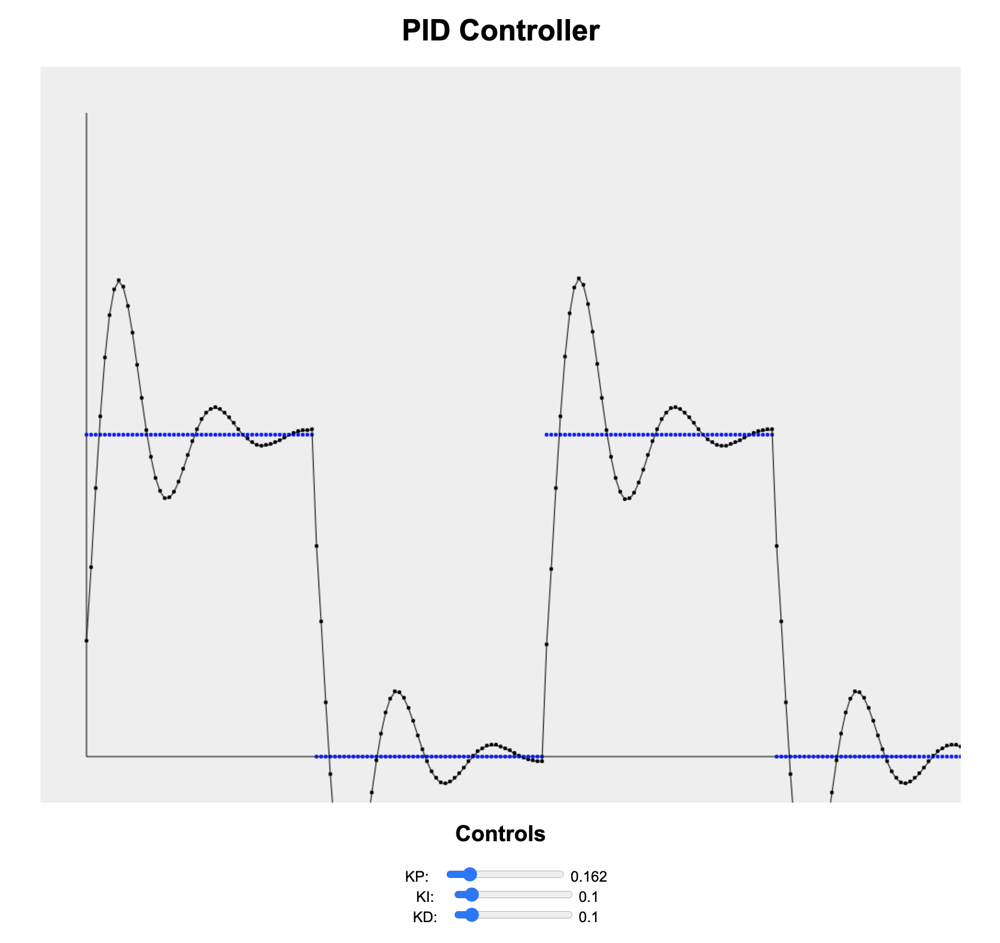

# PID Controller in Javascript

Example PID controller written in Javascript.

### Running

Clone repo, open `index.html` in chrome.

### More Information

https://en.wikipedia.org/wiki/PID_controller